# FESTAI

지역축제의 방문객 안내, 현장 운영, ESG 성과 관리를 연결하는 AI·ESG 플랫폼입니다.
방문객 QR 모바일 웹, 운영자 콘솔, 참여업체 콘솔과 API 서버를 하나의 모노레포에서 관리합니다.

## 프로젝트 소개


| 대상     | 주요 기능                                                                            |
| ---------- | -------------------------------------------------------------------------------------- |
| 방문객   | AI·음성 안내, 회차 예약·모바일 대기표, 쿠폰·리워드·설문, 4개 언어 지원           |
| 운영자   | 콘텐츠 검수·게시, 혼잡·민원·사고 관리, 참여업체 심사, ESG 실적·보고서, 감사 로그 |
| 참여업체 | 초대 가입, 부스·메뉴·쿠폰 관리                                                     |

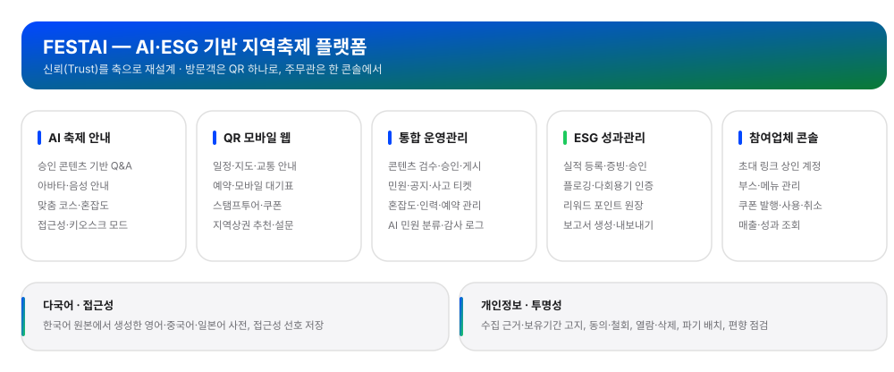

## 기술 스택


| 영역         | 구성                                                                                  |
| -------------- | --------------------------------------------------------------------------------------- |
| 프론트엔드   | TypeScript · Next.js · React · Tailwind CSS · shadcn · Zustand · TanStack Query |
| 백엔드       | Python · FastAPI · psycopg · PyJWT                                                 |
| 데이터베이스 | PostgreSQL                                                                            |
| AI·음성     | Alan · LiveAvatar · 선택 음성 런타임 CosyVoice                                      |
| 배포         | Vercel · Docker · Railway                                                           |

## 시스템 아키텍처

<p align="center">
  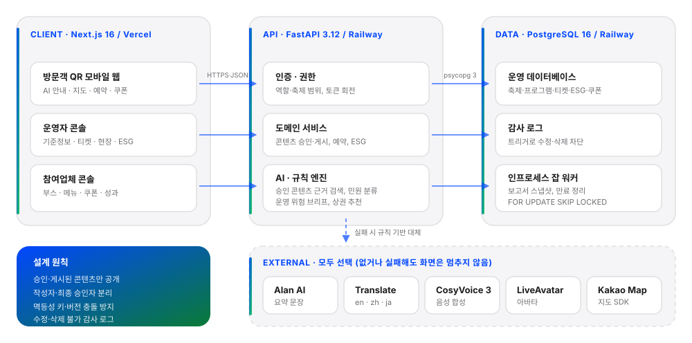
</p>

### 아키텍처 선택 이유

- 클라이언트는 역할별로 나누고, API는 하나로 두어 권한 정책을 한 곳에서 통제합니다.
- 방문객 웹은 첫 화면 속도가 중요해 Next.js, AI·데이터 처리는 파이썬 생태계가 필요해 FastAPI를 썼습니다.
- 축제 단위 트래픽에는 PostgreSQL 한 대면 충분해, 잡 큐도 DB 안에서 처리합니다.
- 감사 로그는 DB 트리거로 막아 어떤 경로로 들어와도 수정·삭제되지 않습니다.
- 외부 AI는 모두 선택 사항이라, 장애가 나도 규칙 기반으로 대체되고 현장은 멈추지 않습니다.

## 시작하기

### 저장소 구성

```text
backend/      # API·DB 마이그레이션·선택 음성 런타임
frontend/     # 방문객 웹·운영자·참여업체 콘솔
docs/         # 요구사항·설계·작업 현황·배포 가이드·이미지
```

Node.js 20 이상과 npm, Python 3.12 이상, Docker가 필요합니다.
각 앱 디렉터리에서 의존성을 설치하고, 환경 변수 파일도 해당 디렉터리에 둡니다.

1. [백엔드 시작하기](backend/README.md#시작하기)에 따라 PostgreSQL, 마이그레이션·시드, API 서버를 준비합니다.
2. [프론트엔드 시작하기](frontend/README.md#시작하기)에 따라 의존성과 환경 변수를 설정하고 개발 서버를 실행합니다.
3. [로컬 웹](http://localhost:3000)과 [API 문서](http://localhost:8000/docs)를 엽니다.

선택 음성 서비스는 [음성 런타임 안내](backend/voice/README.md), 배포는 [배포 가이드](docs/reference/deploy.md)를 따릅니다.

## 사용 방법


| 대상           | 화면 경로          |
| ---------------- | -------------------- |
| 방문객         | `/visitor`         |
| 운영자         | `/admin`           |
| 참여업체       | `/merchant`        |
| 상인 초대 수락 | `/merchant-invite` |

로그인 정보는 [로컬·데모 계정](backend/README.md#데모-계정과-시드)을 참고합니다.
방문객 안내는 승인·게시된 콘텐츠를 사용하며, 외부 AI 연결 실패 시 규칙 기반 답변으로 대체됩니다.

### 화면 미리보기

#### 방문객 모바일 웹

QR 하나로 들어와 로그인 없이 쓰는 화면입니다. 현장 키오스크 모드에서는 카메라 프레임이 브라우저를 벗어나지 않는 기기 내 추정으로 고령 방문객에게만 큰 글씨를 제안합니다.


| 홈                       | AI 안내                            | 스탬프투어                 | 예약·대기표              |
| -------------------------- | ------------------------------------ | ---------------------------- | --------------------------- |
| 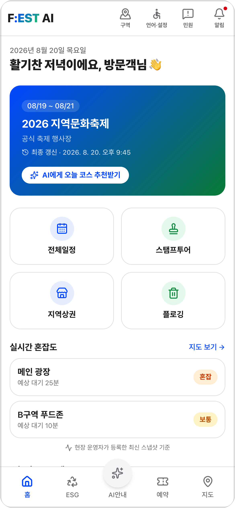 |  | 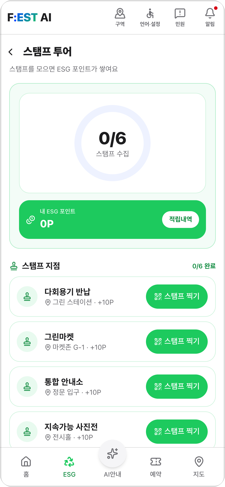 | 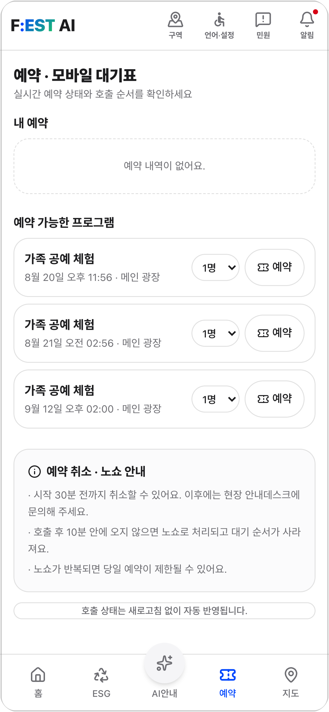 |
| 축제 요약·실시간 혼잡도 | 아바타·음성 Q&A, 승인 정보만 인용 | QR 스탬프 적립·ESG 포인트 | 회차 예약과 모바일 대기표 |

#### 운영자 콘솔

주무관이 한 콘솔에서 현장·민원·성과를 봅니다.


| 운영 대시보드                | AI 민원 인사이트                     | ESG 성과관리                    |
| ------------------------------ | -------------------------------------- | --------------------------------- |
| 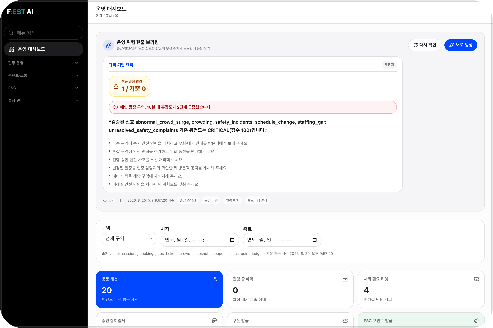 | 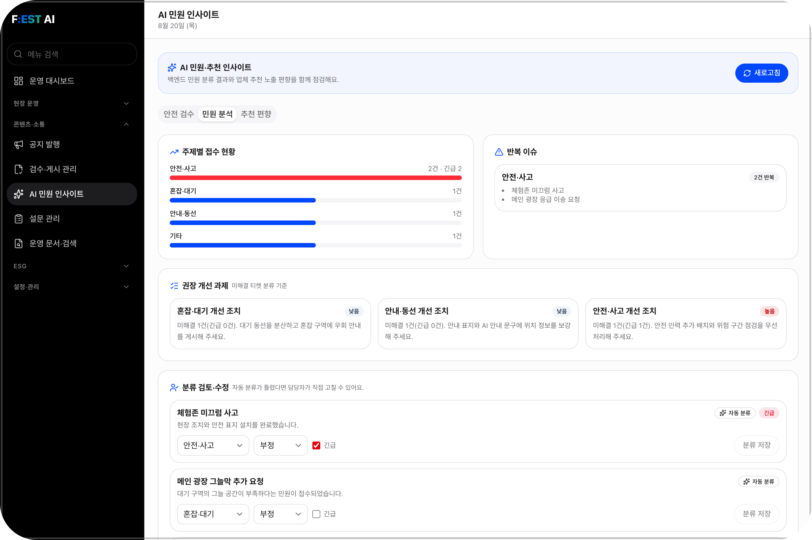 | 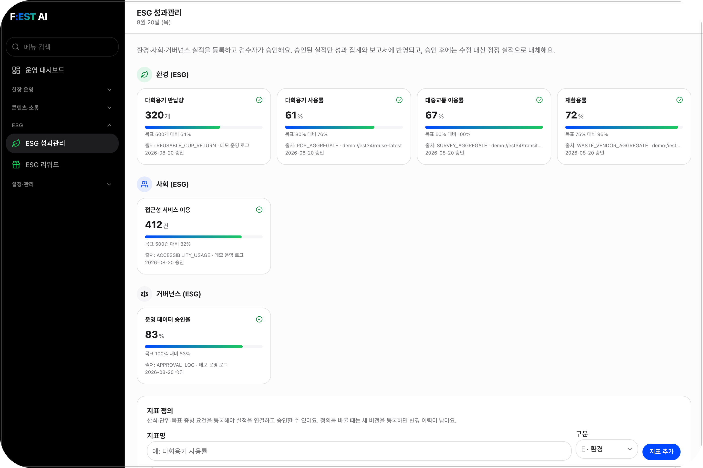 |
| 규칙 기반 위험 브리핑과 근거 | 민원 자동 분류·반복 이슈·권장 조치 | E·S·G 지표별 승인 실적과 출처 |

#### 참여업체 · 현장 · 신뢰


| 참여업체 콘솔                     | 참여업체 심사·쿠폰               | 현장 운영                 | 감사 로그                           |
| ----------------------------------- | ----------------------------------- | --------------------------- | ------------------------------------- |
| 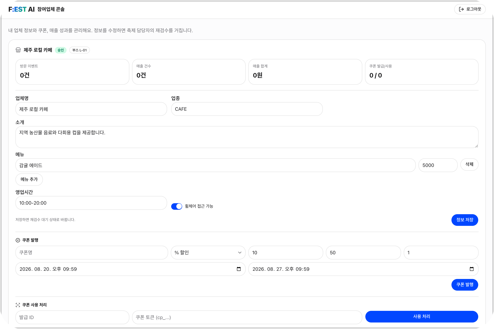 | 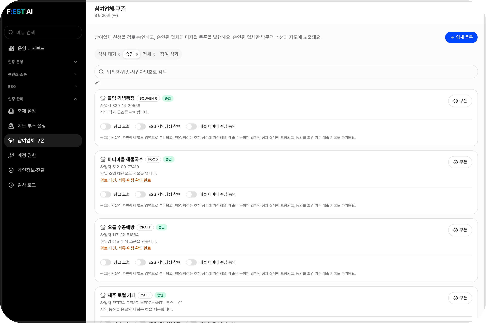 | 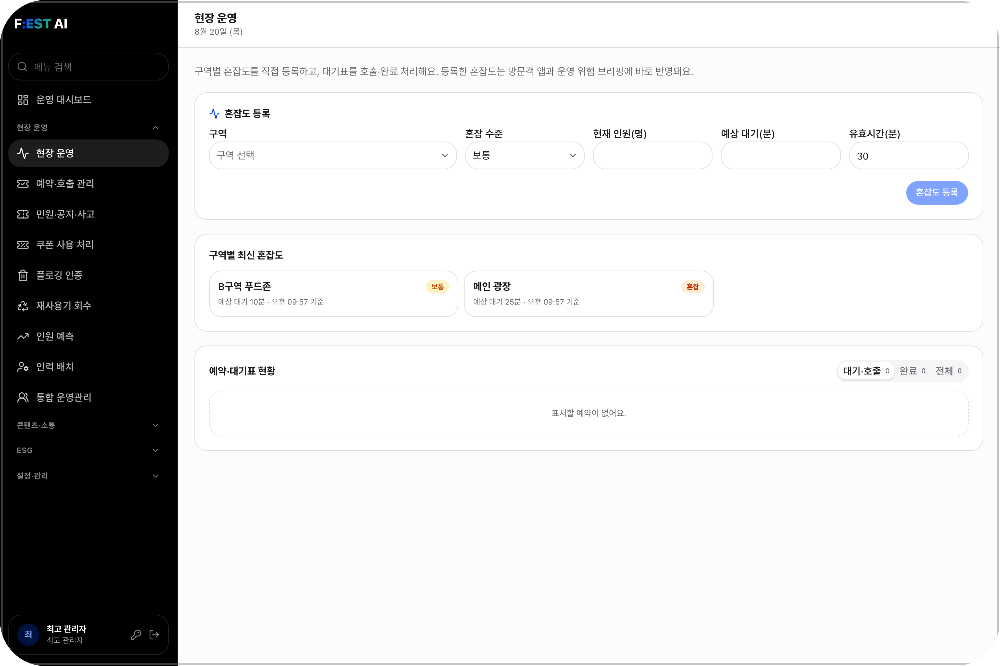 | 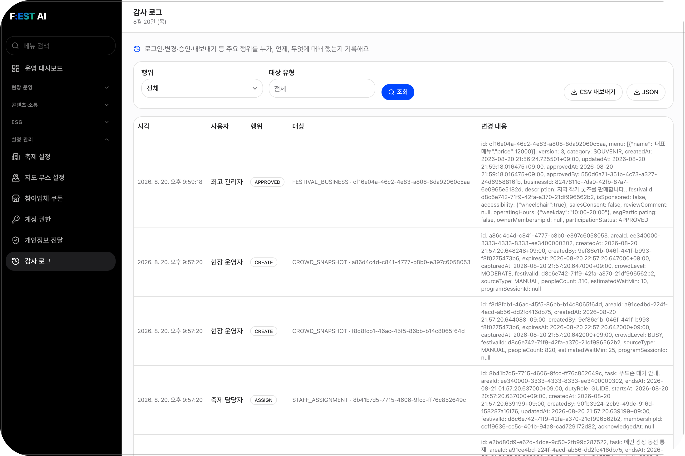 |
| 상인이 직접 쓰는 부스·메뉴·쿠폰 | 신청 검토·승인·반려와 쿠폰 발행 | 혼잡도 등록과 대기표 호출 | 누가·언제·무엇을, 수정·삭제 불가 |

> 화면은 로컬 데모 데이터(`scripts.seed` + 데모 보강)로 캡처했습니다.

## 테스트

- [프론트엔드 테스트](frontend/README.md#테스트): 규칙·다국어 사전 검사, lint, 프로덕션 빌드
- [백엔드 테스트](backend/README.md#테스트): 도메인·API·SQL 테스트와 스모크 검사

API·SQL 테스트에는 마이그레이션·시드가 적용된 PostgreSQL이 필요합니다. DB 부재로 건너뛴 테스트는 통과로 보지 않습니다.
스모크 검사는 데이터를 생성하므로 로컬 또는 전용 데모 환경에서 실행합니다.

## 관련 문서


| 문서                                    | 내용                                  |
| ----------------------------------------- | --------------------------------------- |
| [요구사항](docs/spec.md)                | 제품 범위·동작 규칙·완료 기준       |
| [구현 계획](docs/plan.md)               | 아키텍처·검증 전략·남은 제약        |
| [작업 현황](docs/tasks.md)              | 진행 현황·남은 작업·완료 내역       |
| [배포 가이드](docs/reference/deploy.md) | 환경 설정·배포·운영 점검            |
| [프론트엔드](frontend/README.md)        | 설치·실행·환경 변수·다국어·테스트 |
| [백엔드](backend/README.md)             | 설치·실행·데모 계정·API·테스트    |
| [작업 지침](AGENTS.md)                  | 문서별 역할과 변경 원칙               |

## 팀 구성

<table>
  <tr><td align="center"><a href="https://github.com/duckduck-e"></a></td><td><b>강덕현</b><br/><sub>프론트엔드</sub></td><td>AI 안내·키오스크 경험</td></tr>
  <tr><td align="center"><a href="https://github.com/nadanaya"></a></td><td><b>김나영</b><br/><sub>백엔드</sub></td><td>AI 컨텍스트 연동과 공개 데이터 API</td></tr>
  <tr><td align="center"><a href="https://github.com/gksl3690"></a></td><td><b>서하니</b><br/><sub>기획</sub></td><td>서비스 기획과 문서·발표</td></tr>
  <tr><td align="center"><a href="https://github.com/juuhye"></a></td><td><b>심주혜</b><br/><sub>프론트엔드</sub></td><td>방문객·운영자 화면과 다국어</td></tr>
  <tr><td align="center"><a href="https://github.com/ken-jeong"></a></td><td><b>정상겸</b><br/><sub>풀스택</sub></td><td>백엔드 설계·구축, 프론트 연동, 배포</td></tr>
</table>
